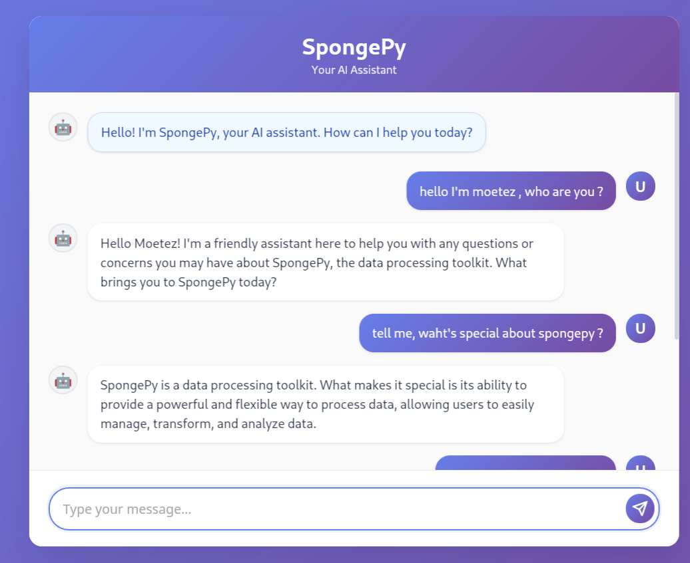
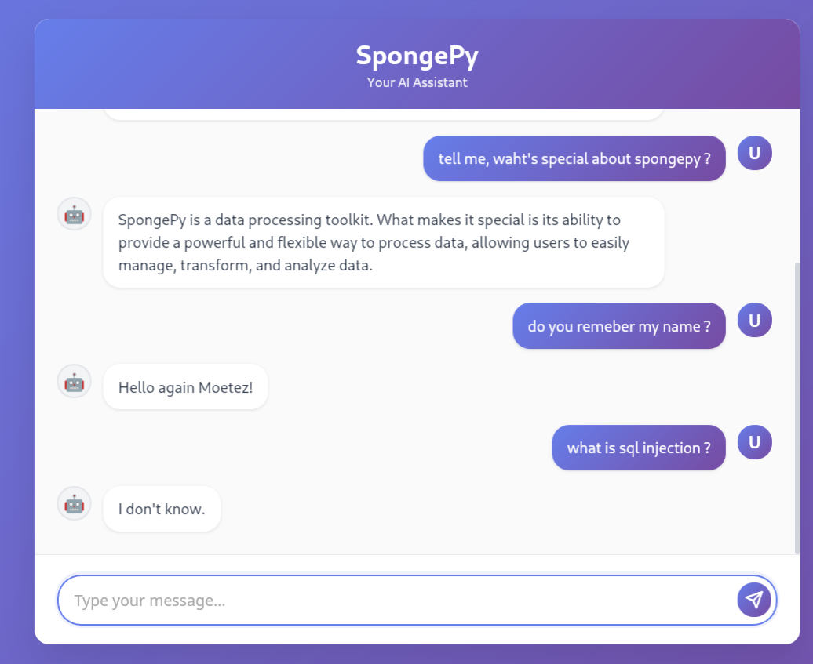
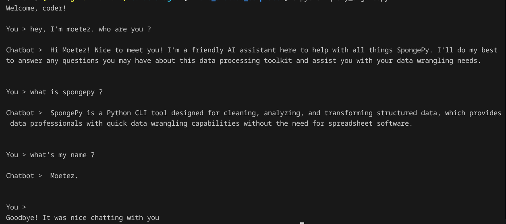

# Chatbot-Template-Llamaindex-Chroma

This project is a conversational **AI assistant** designed to help users interact with **SpongePy**, a Python CLI tool for cleaning, analyzing, and transforming structured data, developed by me.

The chatbot leverages Retrieval-Augmented Generation **(RAG)** to provide accurate answers based on documentation and context files. With minimal adjustments—modifying the prompt in query_engine.py and updating the files in data/—this template can be adapted to create AI assistants for **any topic** or knowledge base.

## Exemple Use

### Web




### Terminal



## Features

- **Conversational Q&A:** Ask questions about SpongePy's features, usage, installation, and troubleshooting.
- **Contextual Answers:** Responses are based strictly on provided documentation and context files.
- **10-messages Long Context:** For remembering past informations.
- **FastAPI Backend:** REST API for chat interactions.
- **Vector Search:** Uses semantic search to retrieve relevant information.
- **Easy Setup:** Minimal configuration required.

## Project Structure

```
llama_chatbot_template/
├── data/                # Context files (QnAs, documentation, etc.)
├── static/              # Frontend files (index.html, CSS, JS)
├── query_engine.py      # RAG-based query engine
├── main.py              # FastAPI server
├── read_data.py         # Data loading and chunking utilities
├── requirements.txt     # Python dependencies
└── README.md            # Project documentation
```

## Getting Started

### Prerequisites

- Python 3.8+
- [pip](https://pip.pypa.io/en/stable/)
- API key for OpenRouter or compatible LLM provider

### Installation

1. **Clone the repository:**
   ```bash
   git clone https://github.com/Moetez-Fradi/SpongePy
   cd llama_chatbot_template
   ```

2. **Install dependencies:**
   ```bash
   pip install -r requirements.txt
   ```

3. **Set environment variables:**
   - Create a `.env` file in the project root:
     ```
     OPENAI_BASE_URL=<your_llm_api_base_url>
     OPENROUTER_API_KEY=<your_api_key>
     ```

4. **Prepare context data:**
   - Place documentation files (TXT, PDF) in the `data/` folder.

### Running the Chatbot

Start the FastAPI server:

```bash
uvicorn main:app --reload
```

Access the chatbot UI at [http://localhost:8000](http://localhost:8000).

### Terminal Testing

You can also interact with the chatbot via terminal:

```bash
python query_engine.py
```

## Usage

- **Ask questions** about SpongePy's installation, features, configuration, and troubleshooting.
- The chatbot will respond based on the context files provided in the `data/` folder.

## Customization

- **Add more context:** Place additional TXT or PDF files in the `data/` directory.
- **Change model:** Edit `query_engine.py` to use a different LLM or embedding model.

## Contributing

1. Fork the repository.
2. Make your changes.
3. Submit a pull request.
4. Ensure your code follows project standards and includes tests if applicable.

## Support

- **Bug reports & feature requests:** Open an issue on GitHub.
- **Questions:** Use the chatbot or refer to the documentation.

## License

MIT License

---

**Repository:** [SpongePy on GitHub](https://github.com/Moetez-Fradi/SpongePy)
